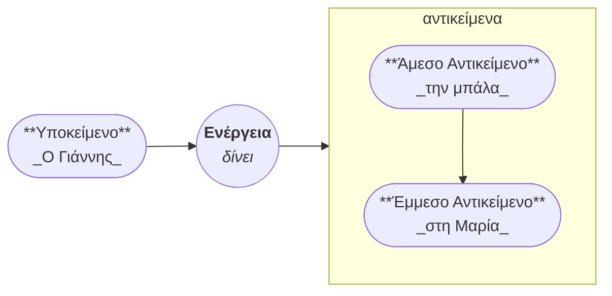
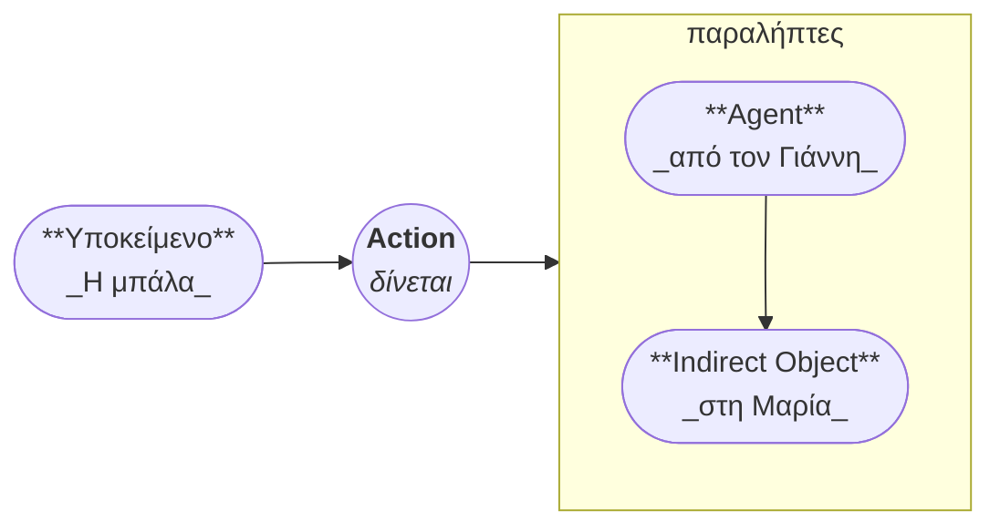
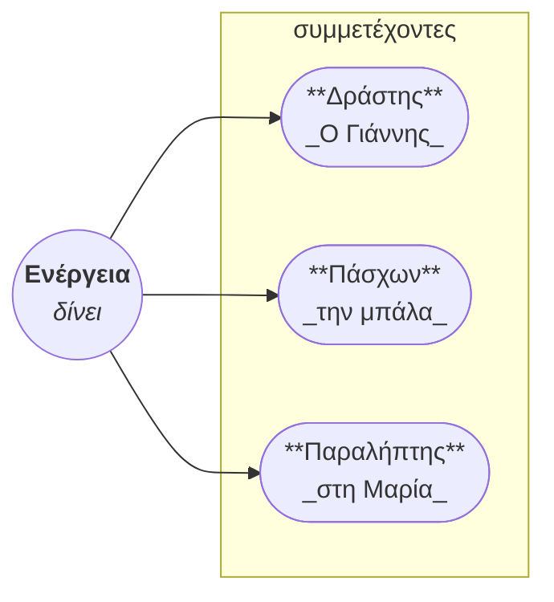

# Αρκάδια

Η Αρκάδια είναι μια εξαιρετικά εκφραστική κατασκευασμένη γλώσσα, βασισμένη στην **συνέπεια και την σαφήνεια**, εξαλείφοντας εντελώς τις εξαιρέσεις.

Η **καινοτόμος γραμματική και σύνταξή της**, σε συνδυασμό με την εξαιρετική εκφραστικότητα και ακρίβεια, καθιστούν την καμπύλη μάθησης απότομη.
Ωστόσο, επειδή η Αρκάδια είναι **λογική και προβλέψιμη**, με μια **απλή ορθογραφία και φωνολογία**, ένα **μικρό λεξιλόγιο** που επεκτείνεται μέσω προθεμάτων, η γλώσσα γίνεται πιο εύκολη μόλις μάθετε τα θεμέλια.

---

## Πώς να χρησιμοποιήσετε αυτόν τον οδηγό

Για να αποκτήσετε μια βασική κατανόηση της σύνταξης στην Αρκάδια, **ακολουθήστε αυτή τη σειρά**:

1. Διαβάστε τους **[Γενικούς κανόνες για τα Ρήματα][verbs]**.
2. Έπειτα, διαβάστε τον **[Γενικούς κανόνες για τα Ουσιαστικά][nouns]**.
3. Μετά, ακολουθήστε τους **[Κανόνες για τα άρθρα][articles]**.

Το **[Λεξιλόγιο][vocabulary]** μπορεί να παραληφθεί, και είναι απλά ένα σημείο αναφοράς, αλλά όλα τα άλλα τμήματα είναι δομημένα για να διαβαστούν **με τη σειρά που εμφανίζονται στο ευρετήριο**.

---

## Σύνταξη

Η σύνταξη της Αρκάδια έχει σχεδιαστεί για να είναι **διαισθητική και ευέλικτη**.
Η τυπική σειρά λέξεων είναι **Ρήμα-Υποκείμενο-Αντικείμενο (VSO)**, δίνοντας έμφαση στην **ενέργεια παρά στον δράστη**.
Ωστόσο, ως **γλώσσα που επιτρέπει την παράλειψη αντωνυμιών, με γραμματικές πτώσεις**, η σειρά των λέξεων μπορεί να αλλάξει **για έμφαση**.

Η Αρκάδια ακολουθεί την **Αυστρονησιακή συμφωνία**, αλλά **όχι αποκλειστικά**. Ενσωματώνει στοιχεία και από άλλα **συστήματα συμφωνίας**.

### **Κατανόηση της Σύνταξης μέσω Διαγραμμάτων**

Οι παραδοσιακές **ονομαστικές-αιτιατικές γλώσσες** ακολουθούν μια ασύμμετρη δομή.
Στην **ενεργητική φωνή**, το **υποκείμενο** είναι ο κύριος δράστης, το **ρήμα** μεταφέρει την ενέργεια, το **άμεσο αντικείμενο** δέχεται την ενέργεια και το **έμμεσο αντικείμενο** είναι ο παραλήπτης.

Στην **παθητική φωνή**, το **άμεσο αντικείμενο** μπορεί να προαχθεί, αλλά η σύνταξη υφίσταται σημαντικές αλλαγές:

---

### **Η Συμμετρική Σύνταξη της Αρκάδια**

Η σύνταξη της Αρκάδια είναι **συμμετρική**, ακολουθώντας την **Αυστρονησιακή ευθυγράμμιση**.

Ο **δράστης, ο πάσχων και ο παραλήπτης** μπορούν να λειτουργήσουν **όλοι** ως η εστίαση της πρότασης.

!!! warning "Παραλήπτης"

    Ο παραλήπτης εδώ αναφέρεται στον **παραλήπτη του πάσχοντος**, **όχι στην ενέργεια** αυτή καθεαυτή.

Για να κατανοήσετε πλήρως το **σύστημα πτώσεων** της Αρκάδια, ανατρέξτε στον **[Οδηγό Πτώσεων Ονομάτων][cases]**.
Για μετασχηματισμούς ρημάτων, δείτε τον **[Κανόνες Δημιουργίας Ρημάτων][generation]**.

---

## Δευτερεύουσες προτάσεις

Η Αρκάδια επιτρέπει έναν **άπειρο αριθμό εσωτερικών δευτερευουσών προτάσεων**, επιτρέποντας πολύ εκφραστικές ιδέες.

- Οι δευτερεύουσες προτάσεις χρησιμοποιούν την **ενδεικτική διάθεση**, πράγμα που σημαίνει ότι **διατηρούν τα δικά τους υποκείμενα**.
- **Ο χρόνος είναι πάντα σχετικός** με την **προηγούμενη πρόταση**, εξασφαλίζοντας ομαλή πρόοδο της αφήγησης.

[articles]: ./determiners/articles.md
[verbs]: ./verbs/index.md
[nouns]: ./nouns/index.md
[vocabulary]: ./vocabulary/index.md
[cases]: ./nouns/case.md
[generation]: ./generation/verbs.md
