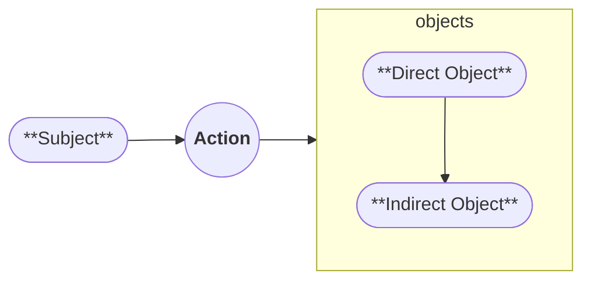
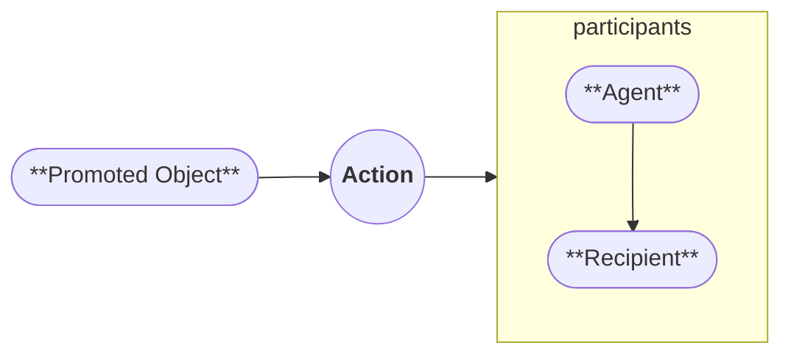
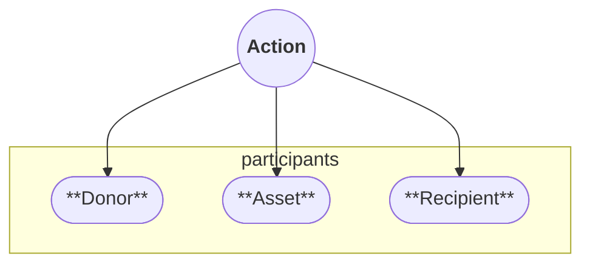

# Arcadia

Arcadia is a constructed language designed around regularity, transparent spelling, and grammatically meaningful sound patterns.

The language prioritises:

- predictable orthography;
- a compact vowel system;
- controlled phonotactics;
- regular derivation and inflection;
- syntactic roles that are explicit rather than inferred from word order alone.

The documentation describes the current specification of the language.
Some areas, especially vocabulary, idiom, and edge-case syntax, remain under active development.

## How to Use This Guide

For a first reading, use the following order:

1. Read the [Phonology and Orthography Guide][phonology].
2. Read the [Verbs Guide][verbs].
3. Read the [Nouns Guide][nouns].
4. Review the [Articles Guide][articles].

The [Vocabulary Guide][vocabulary] is primarily a reference section.
It does not need to be read linearly.

## Core Structure

Arcadia is built around a verb-centred syntax.

The standard clause order is verb-initial: the verb comes first, followed by its participant roles.
Because the language uses explicit role marking and allows any recoverable role to be omitted, word order may shift for information structure, emphasis, or discourse flow.

Arcadia is influenced by Austronesian-style alignment, but does not implement a purely Austronesian system.
Its grammar treats clause participants as roles licensed by the verb, rather than treating one participant role as structurally primary in every clause.

For the details of the case system, see the [Noun Cases Guide][cases].
For verbal morphology and derived verb forms, see the [Verb Generation Guide][generation].

## Syntax

Many nominative-accusative systems can be described asymmetrically.
In a basic active clause, the subject is structurally central, while objects are organised around the verb as complements.

In a passive construction, one object may be promoted, but the structure of the clause changes.

### Arcadian Symmetry

Arcadian syntax is designed to be more symmetric.
The verb remains the structural centre of the clause, and each participant is interpreted through the role assigned to it.

In this model, participant roles are not merely positional.
A clause can foreground different roles without requiring a passive-style restructuring of the entire sentence.

## Secondary Clauses

Arcadia permits finite secondary clauses.

A secondary clause may contain a fully inflected verb rather than relying on a personless infinitive.
Depending on the construction, the verb may still express mood, person, tense, and other verbal categories.

By default, tense in a secondary clause is interpreted from the narrator's temporal viewpoint, unless another rule or construction explicitly shifts that reference point.

Secondary clauses also interact with the phonological system through secondary devoicing, where relevant voiced verbal consonants surface as their voiceless counterparts in secondary environments.

## Development Roadmap

This roadmap records the current documentation and stabilisation targets for Arcadia.

| Version  | Focus                        | Main Criteria                                                                                                                                                       | Status          |
| :------- | :--------------------------- | :------------------------------------------------------------------------------------------------------------------------------------------------------------------ | :-------------- |
| **v0.2** | Lexicon and aesthetic freeze | Establish enough vocabulary to test the language in extended text. Stabilise the current sound system, phonotactics, and major spelling conventions.                | **In Progress** |
| **v0.3** | Structural foundation freeze | Finalise the major morphology and syntax rules, including noun cases, verbal categories, clause structure, and the abstract syntax model used by formal tooling.    | **Planned**     |
| **v1.0** | Functional usability release | Complete the core documentation and resolve remaining high-impact edge cases. The language should be usable for complex communication within the documented system. | **Planned**     |
| **v2.0** | Formal analysis and tooling  | Develop parser-facing grammar definitions and document stable allophonic or dialectal variation that emerges from use.                                              | **Planned**     |

[phonology]: ./01-phonology/00-index.md
[orthography]: ./01-phonology/01-orthography.md
[articles]: ./04-grammar/03-determiners/01-articles.md
[verbs]: ./04-grammar/01-verbs/00-index.md
[nouns]: ./04-grammar/02-nouns/00-index.md
[vocabulary]: ./02-vocabulary/01-dictionary/00-index.md
[cases]: ./04-grammar/02-nouns/02-case.md
[generation]: ./02-vocabulary/02-word-formation/01-verbs.md
