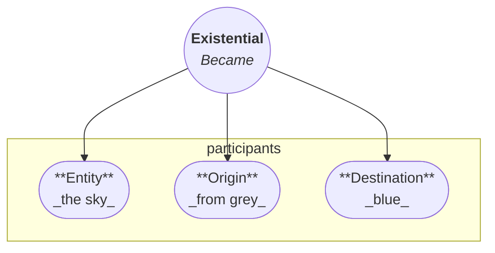
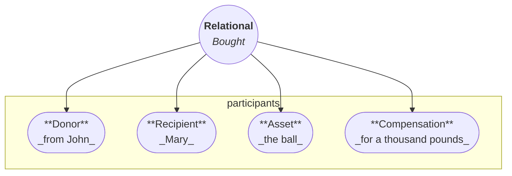
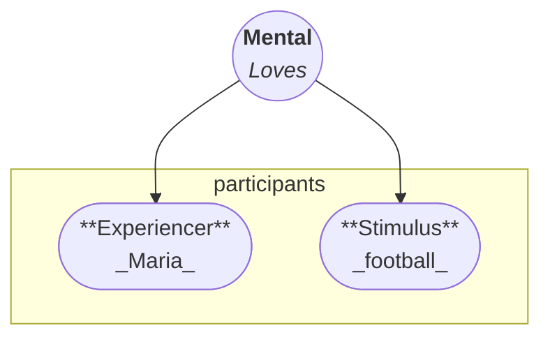
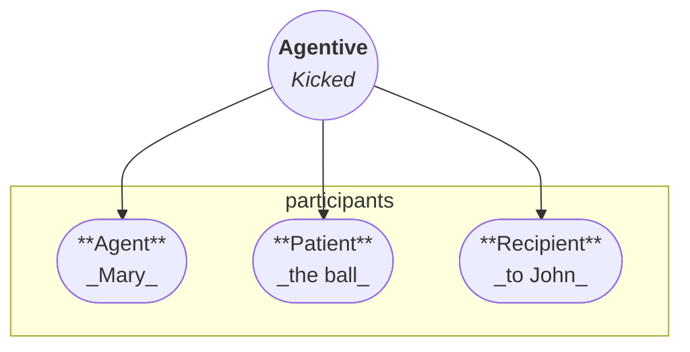

# Verb Types

In Arcadia, verb type determines clause structure.
The verb functions as the structural core of the clause: it licenses participant roles and determines which roles are mandatory or optional.

Arcadia does not categorise verbs by transitivity.
Valency emerges from verb type and role structure, not from a transitive–intransitive distinction.

Arcadia is pivotless.
No participant is grammatically privileged over the others, and no role is promoted to control the clause.
Participant roles are identified directly through semantic case marking.

## Roles

A **role** is a participant position licensed by a verb.
Each clause has at most one verb, and each verb type defines which roles may appear with that verb.

Roles are divided into two groups:

- **Mandatory roles** are required by the verb's role pattern.
- **Optional roles** may appear when the clause needs them, but they are not required for the verb to form a complete clause.

A mandatory role may still be absent from the surface clause.
It can be omitted when agreement or context makes it recoverable, or it can be overloaded when the verb itself supplies that part of the meaning.

For example, _"Maria kicked the ball on Sunday"_ contains one verb, _"kicked"_.
The verb licenses two core roles: _"Maria"_ as the agent and _"the ball"_ as the patient.
The phrase _"on Sunday"_ is not a core participant role; it is an optional time expression.

_"Kicked"_ alone does not form a complete clause in this use.
_"Maria kicked the ball"_ does, because the mandatory roles licensed by the verb have been assigned.

## Overloading

**Overloading** occurs when a verb contains one or more roles inside its lexical meaning.
An overloaded role is still part of the verb's meaning, but it cannot be assigned independently in the clause.

Overloading is different from omission.
When a role is omitted, the role is still recoverable from agreement, morphology, or discourse context.
When a role is overloaded, the verb itself supplies that part of the meaning.

For example, a liminal verb normally licenses an entity, an origin, and a destination.
A clause can assign those roles explicitly:

**The ice changed from a solid into a liquid.**

Here, _"the ice"_ is the entity, _"from a solid"_ is the origin, and _"into a liquid"_ is the destination.

The verb _"melt"_ is different.
In _"The ice melted"_, the change from solid to liquid is built into the verb.
The origin and destination are overloaded, so they are not assigned as independent roles.

## Types

Arcadia distinguishes four core verb types:

- [Existential verbs](#existential-verbs)
    - [Stative verbs](#stative-verbs)
    - [Liminal verbs](#liminal-verbs)
- [Relational verbs](#relational-verbs)
    - [Relationship verbs](#relationship-verbs)
    - [Transfer verbs](#transfer-verbs)
- [Mental verbs](#mental-verbs)
    - [Experiential verbs](#experiential-verbs)
    - [Cognitive verbs](#cognitive-verbs)
- [Agentive verbs](#agentive-verbs)

In all verb types, the verb comes first in the clause.
Core roles follow in the canonical order defined by the verb type, followed by optional expressions.
Case marking allows roles to be reordered when the intended structure remains recoverable.

## Existential Verbs

Existential verbs describe being, states, locations, movement, natural phenomena, and changes of state.
They are divided into two subtypes: stative verbs and liminal verbs.

### Stative Verbs { #stative-verbs }

Stative verbs describe states, properties, locations, movement, existence, or natural phenomena.

**Roles:**

- **Entity**: the thing that exists, moves, or has the state.
- **State**: the state, property, location, movement, or phenomenon.

**Canonical order:** Verb - Entity - State

**Overloading:** Stative verbs can be totally overloaded.
When a stative verb is totally overloaded, no role is assigned in the clause and the verb drops personal and number marking.
Natural-phenomenon verbs such as weather expressions are typical examples.

### Liminal Verbs { #liminal-verbs }

Liminal verbs describe transitions or changes of state.

**Roles:**

- **Entity**: the thing undergoing the transition.
- **Origin**: the starting point or previous state.
- **Destination**: the endpoint or resulting state.

**Canonical order:** Verb - Entity - Origin - Destination

**Overloading:** Liminal verbs often overload the origin, the destination, or both.
For example, _"melt"_ includes the change from solid to liquid, so those endpoints are not assigned separately.

## Relational Verbs

Relational verbs describe relationships, possession, and changes in who has or controls something.
They are divided into two subtypes: relationship verbs and transfer verbs.

### Relationship Verbs { #relationship-verbs }

Relationship verbs describe relationships or possession.

**Roles:**

- **Relator**: the participant from whose perspective the relationship is framed.
- **Correlate**: the other participant or thing in the relationship.
- **Relationship**: the relation that connects them.

**Canonical order:** Verb - Relator - Correlate - Relationship

**Overloading:** Relationship verbs are often relationship-overloaded.
For example, a possession verb may contain the relationship meaning _"have"_, so the clause assigns the relator and correlate without separately assigning the relationship itself.

### Transfer Verbs { #transfer-verbs }

Transfer verbs describe a change of relationship through giving, receiving, selling, buying, or transfer.

**Roles:**

- **Donor**: the participant from whom the asset moves.
- **Recipient**: the participant to whom the asset moves.
- **Asset**: the thing transferred.
- **Compensation**: the payment, exchange, or return value.

**Canonical order:** Verb - Donor - Recipient - Asset - Compensation

**Overloading:** Transfer verbs may overload parts of the transfer or exchange structure.
Perspective does not change the syntactic status of any participant: donor, recipient, asset, and compensation remain equally identified by their semantic roles.

## Mental Verbs

Mental verbs describe experience, perception, emotion, knowledge, thought, and mental content.
They are divided into two subtypes: experiential verbs and cognitive verbs.

### Experiential Verbs { #experiential-verbs }

Experiential verbs describe preferences, sensations, or emotions.

**Roles:**

- **Experiencer**: the participant having the feeling, sensation, or preference.
- **Stimulus**: the thing that causes, receives, or defines the experience.

**Canonical order:** Verb - Experiencer - Stimulus

**Overloading:** Experiential verbs may overload the stimulus when the experience is lexicalised as a general state, sensation, or condition.

### Cognitive Verbs { #cognitive-verbs }

Cognitive verbs describe knowledge, thought, dreaming, memory, belief, or other mental content.

**Roles:**

- **Cogniser**: the participant who knows, thinks, remembers, dreams, or believes.
- **Concept**: the thought, knowledge, memory, belief, or content.

**Canonical order:** Verb - Cogniser - Concept

**Overloading:** Cognitive verbs may overload the concept when the verb names a specific mental activity whose content is not independently assigned.

## Agentive Verbs

Agentive verbs describe actions, communication, interaction, and events.
They are not divided into subtypes in the current system.

**Roles:**

- **Agent**: the participant carrying out or initiating the action.
- **Patient**: the participant affected by the action.
- **Recipient**: the participant towards whom the action, message, or result is directed.

**Canonical order:** Verb - Agent - Patient - Recipient

**Overloading:** Agentive verbs may overload the patient or recipient when the affected participant or endpoint is included in the verb's meaning.

## Role-to-Case Mapping

Arcadian clauses have no pivot.
Each participant is marked directly according to the semantic role licensed by the verb, and no role receives a privileged nominative status.
Phrase-level case realisation is described in the [phrase structure guide][phrase-structure].

| Type         | Role         | Case         |
| ------------ | ------------ | ------------ |
| Stative      | Entity       | Thematic     |
| Stative      | State        | Essive       |
| Liminal      | Entity       | Thematic     |
| Liminal      | Origin       | Ablative     |
| Liminal      | Destination  | Allative     |
| Relationship | Relator      | Thematic     |
| Relationship | Correlate    | Comitative   |
| Relationship | Relationship | Essive       |
| Transfer     | Asset        | Thematic     |
| Transfer     | Donor        | Ablative     |
| Transfer     | Recipient    | Allative     |
| Transfer     | Compensation | Benefactive  |
| Experiential | Experiencer  | Experiential |
| Experiential | Stimulus     | Stimulative  |
| Cognitive    | Cogniser     | Cognitive    |
| Cognitive    | Concept      | Conceptual   |
| Agentive     | Agent        | Ergative     |
| Agentive     | Patient      | Accusative   |
| Agentive     | Recipient    | Dative       |

The names of the four mental-role cases remain provisional.
Their defining property is that they mark their semantic roles directly rather than deriving from pivot selection.

## Reflexivity and Reciprocity

Arcadia uses prefixes to mark reflexive and reciprocal constructions.

Prefix scope order is fixed:

Reflexive / Reciprocal -> other derivational prefixes -> Root

The reflexive or reciprocal marker has the tightest role-changing scope among prefixes.
Full forms and combinatorial rules are described in the [verb word-formation guide][verb-generation].

[verb-generation]: ../02-vocabulary/02-word-formation/01-verbs.md
[phrase-structure]: ./04-phrase-structure.md
