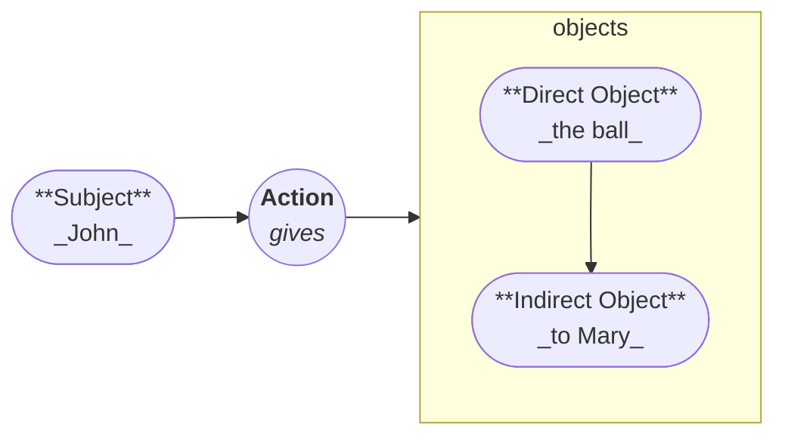
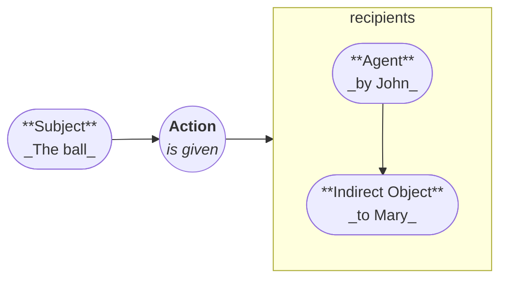
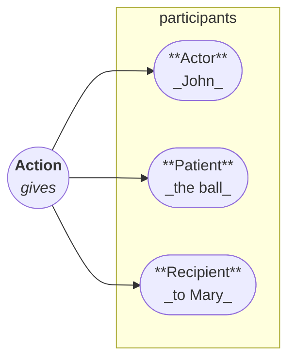

# Arcadia

Arcadia is a highly expressive conlang built on **consistency and clarity**, eliminating exceptions entirely.

Its **innovative grammar and syntax**, coupled with extreme expressiveness and precision, make the learning curve steep.
However, because Arcadia is **logical and predictable**, with a **simple orthography and phonology**, a **small vocabulary** that expands through prefixes, mastery becomes easier once the fundamentals are learned.

## How to Use This Guide

To gain a foundational understanding of Arcadia's syntax, **follow this sequence**:

1. Read the **[Verbs Guide][verbs]**.
2. Review the **[Nouns Guide][nouns]**.
3. Explore the **[Articles Guide][articles]**.

The **[Vocabulary Guide][vocabulary]** serves as a reference, but all other sections should be read **in order as they appear in the navigation**.

## Syntax

Arcadia's syntax is designed to be **intuitive and flexible**.
Its standard word order is **Verb-Subject-Object (VSO)**, emphasizing **action over actor**.
However, as a **pro-drop language with case markings**, word order may shift **for emphasis**.

Arcadia follows the **Austronesian alignment**, but **not purely**; it incorporates elements from other **alignment systems** as well.

### **Understanding Syntax through Diagrams**

Traditional **nominative-accusative languages** follow an asymmetric structure.
In **active voice**, the **subject** is the main actor, the **verb** conveys action, the **direct object** receives the action, and the **indirect object** is the recipient.

In **passive voice**, the **direct object** can be promoted, but the syntax undergoes major changes:

### **Arcadia's Symmetric Syntax**

Arcadia's syntax is **symmetric**, inspired by the **Austronesian alignment**.

The **actor, patient, and recipient** can **all** act as the focus.

!!! note "Recipient"

    The recipient here refers to the **receiver of the patient**, **not the action** itself.

To fully understand Arcadia's **case system**, refer to the **[Noun Cases Guide][cases]**.
For verb transformations, see the **[Verb Generation Guide][generation]**.

## Subclauses

Arcadia allows an **infinite number of nested subclauses**, enabling highly expressive ideas.

- Subclauses use the **indicative mood**, meaning they **retain their own subjects**.
- **Tense is always relative** to the **narrator's perspective**, ensuring seamless narrative progression.

## Development Roadmap: Arcádia

This roadmap outlines the major structural and functional goals for Arcádia, moving from the initial design concept to a fully usable language ready for community adoption and formal analysis.

| Version  | Focus                            | Core Goals                                                                                                                                                                                                                                                                                                                     | Status          |
| :------- | :------------------------------- | :----------------------------------------------------------------------------------------------------------------------------------------------------------------------------------------------------------------------------------------------------------------------------------------------------------------------------- | :-------------- |
| **v0.2** | **Lexicon & Aesthetic Freeze**   | **Vocabulary Finalization:** Translate sufficient passages to stress-test the current word choices, cementing the language's aesthetic (e.g., as an Eclectic IE Synthesis). **Phonotactic Stabilization:** Finalize the rules for sound combinations and acceptable word forms, including rules for clitics/prepositions.      | **In Progress** |
| **v0.3** | **Structural Foundation Freeze** | **Morphology & Grammar Definition:** Finalize all inflectional and derivational rules (parts of speech, noun cases, verb tenses/aspects). **Syntax Formalization:** Define unambiguous rules for sentence structure, including the core principles for generating the **Abstract Syntax Tree (AST)** of any Arcádian sentence. | **Planned**     |
| **v1.0** | **Functional Usability Release** | **Completion:** Finalize all remaining moving parts and edge-case rules. **Usability:** The language is fully documented, consistent, and functionally usable for complex communication. **Pronunciation Guidance:** Begin gathering speaker input to refine pronunciation and suggest finishing touches.                      | **Planned**     |
| **v2.0** | **Formal Analysis & Tooling**    | **Parser Development:** The grammar is precise enough to allow for the creation of a formal language **parser** (based on the v0.3 AST). **Allophony:** Document the observed, natural allophonic variations and pronunciation accents adopted by the speaking community.                                                      | **Planned**     |

[articles]: ./determiners/articles.md
[verbs]: ./verbs/index.md
[nouns]: ./nouns/index.md
[vocabulary]: ./vocabulary/index.md
[cases]: ./nouns/case.md
[generation]: ./generation/verbs.md
