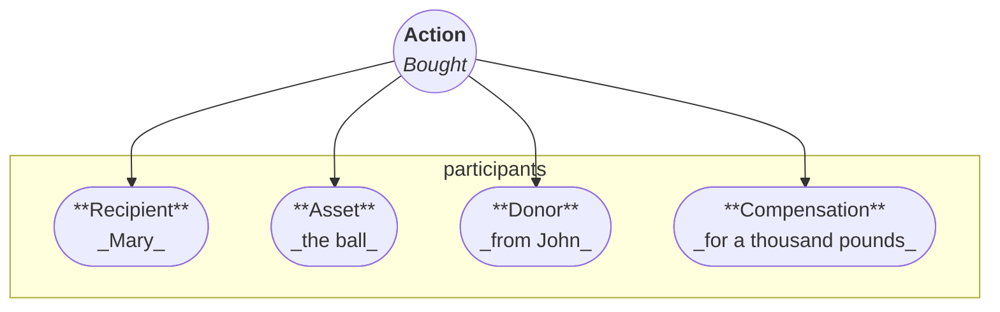
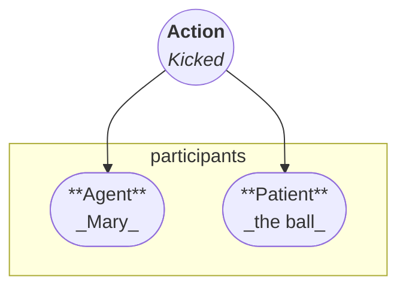
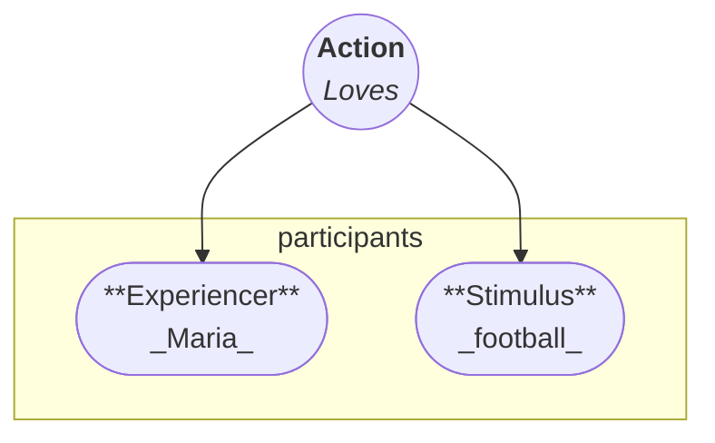

# Verbs

In Arcádia, verb type determines sentence structure.
The verb determines word order and conveys extensive grammatical information through **suffixes**, integrating **[mood][mood], [tense][tense], [aspect][aspect], and [person][person] distinctions**.

Arcádia does not categorise verbs by **transitivity**.
The best analogy to understand the distinction is to think of verb as **the director** of the sentence, orchestrating different _roles_ that the rest of the phrases can have in a sentence.
Some of the roles are mandatory, while others are optional, depending on the verb type.

### Roles

Before we dive into the verb types, here's a quick diagram of three different verbs.

A verb describing **a transaction**:

A verb describing **an action**:

A verb describing **a feeling**:

### Overloading

One other other crucial idea is the idea of overloading.
Let's consider the sentence:

**I am transitioning from developer to a manager.**

"To transition" is a **liminal verb**, therefore it has two mandatory roles to assign: **source** and **destination**.
Let's now consider another liminal verb, to melt:

**The ice is melting**.

"To melt" is overloaded, meaning that it includes the source (_from solid_) and the destination (_to liquid_), and therefore the mandatory roles cannot be assigned.

## Types

Arcádia distinguishes four core **verb types**:

- [Existential verbs](#existential-verbs)
    - [Stative verbs](#stative-verbs)
    - [Liminal verbs](#liminal-verbs)
- [Relational verbs](#relational-verbs)
    - [Relationship verbs](#relationship-verbs)
    - [Transaction verbs](#transaction-verbs)
- [Mental verbs](#mental-verbs)
    - [Experiential verbs](#experiential-verbs)
    - [Cognitive verbs](#cognitive-verbs)
- [Agentive verbs](#agentive-verbs)

In all verb types, the verb always comes **first** in the sentence structure, and is followed by its assigned roles.
The **pivot** comes after the verb, then the other roles follow in any order, first the **mandatory** ones, and finally the **optional** ones.

## Stative verbs { #stative-verbs }

Existential verbs are divided into two subtypes: **stative verbs** and **liminal verbs**.

### Stative verbs { #stative-verbs }

Stative verbs describe **states**, **properties**, **movement**, **existence**, or **natural phenomena**, e.g., _"The sky is blue"_, _"My friend is sick"_, _"I am here"_, _"It's raining"_.

Stative verbs have two mandatory roles, the **entity** and the **state**.
Stative verbs can be **totally overloaded**, meaning that they do not require any roles to be assigned, e.g., _"It is raining"_.
In such cases, the verb **drops** all **personal and number markings**.

### Liminal verbs { #liminal-verbs }

Liminal verbs describe **transitions** or **changes of state**, e.g., _"The ice is melting"_, _"The flowers are blooming"_, _"The boy entered the classroom"_.

Liminal verbs have three mandatory roles, the **entity**, the **origin** and the **destination**.

## Relational verbs { #relational-verbs }

Relational verbs are divided into two subtypes: **relationship verbs** and **transaction verbs**.

## Relationship Verbs { #relationship-verbs }

Relationship verbs describe **relationships** or **possession**, e.g., _"I have a hand"_, _"I have a car"_, _"She is my sister"_.

Relationship verbs have three mandatory roles, the **relator**, the **correlate**, and the **relationship**.
More often than not, relationship verbs are **relationship-overloaded**.

## Transfer Verbs { #transfer-verbs }

Transfer verbs describe a **change of relationship** through giving, receiving, selling, buying,

## Experiential Verbs { #experiential-verbs }

or transfer (e.g., _"I gave her my book"_, _"I sold my car to John for money"_).

- **Donor**: Ergative
- **Asset**: Absolutive
- **Recipient**: Dative
- **Compensation**: Benefactive

## Experiential Verbs { #experiential-verbs }

Experiential verbs describe **preferences, sensations, or emotions** (e.g., _"I like apples"_, _"I feel cold"_, _"My foot itches"_).

### Syntax

**Verb – Experiencer – Stimulus**

## Cognitive Verbs { #cognitive-verbs }

Experiential verbs describe **preferences, sensations, or emotions** (e.g., _"I know mathematics"_, _"I think of you"_, _"He dreamt of a simple life"_).

### Syntax

**Verb – Thinker – Content**

## Action Verbs { #action-verbs }

Action verbs describe **actions**, **communication**, **interaction**, or **events**. (e.g., _"The birds are singing"_, _"I sold a book to Adam"_, _"She wrote a letter"_).

### Syntax

**Verb – Actor – Patient – Recipient**

## Case Marking and Pivoting

| Type         | Role         | Case       | Is the default pivot? |
| ------------ | ------------ | ---------- | --------------------- |
| Stative      | Entity       |            | Yes                   |
| Stative      | State        |            |                       |
| Liminal      | Entity       |            | Yes                   |
| Liminal      | Origin       | Ablative   |                       |
| Liminal      | Destination  | Dative     |                       |
| Relationship | Relator      | Ablative   | Yes                   |
| Relationship | Correlate    | Accusative |                       |
| Relationship | Relationship |            |                       |
| Transfer     | Donor        | Ablative   | Yes                   |
| Transfer     | Recipient    | Dative     |                       |
| Transfer     | Asset        | Accusative |                       |
| Transfer     | Compensation |            |                       |
| Experiential | Experiencer  |            | Yes                   |
| Experiential | Stimulus     | Thematic   |                       |
| Cognitive    | Cogniser     |            | Yes                   |
| Cognitive    | Concept      |            |                       |
| Agentive     | Agent        | Ergative   | Yes                   |
| Agentive     | Patient      |            |                       |

## Reflexivity and Reciprocity

Arcádia uses **prefixes** to indicate **reflexive** and **reciprocal** actions.
The reflexivity prefix is **applied first**, followed by the **focus-shifting prefix**, ensuring the reflexive element remains **closest to the verb root**.

The full set of reflexive and reciprocal markers is detailed in the **[verb generation guide][generation]**.
